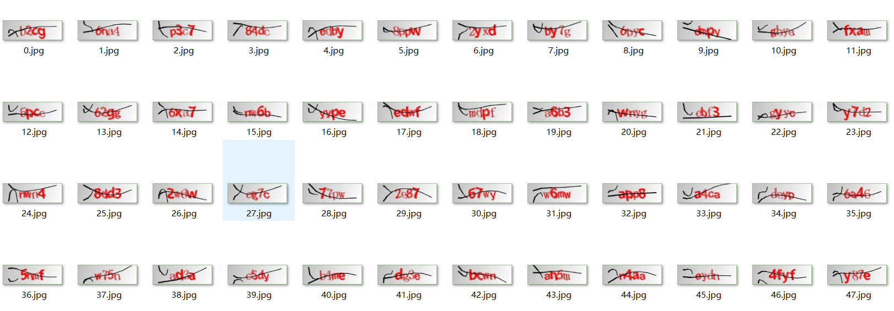
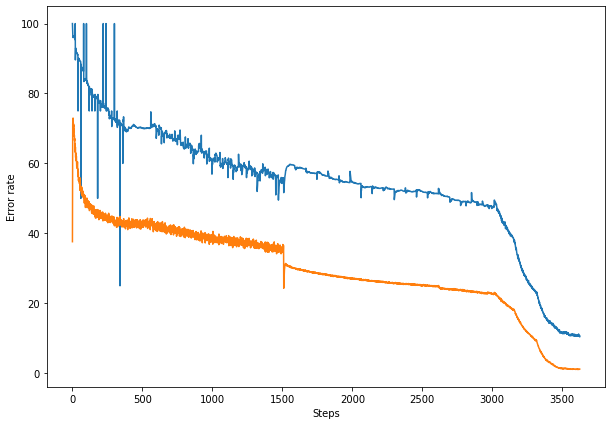

# SCU_Captcha

[](https://github.com/SunnyHaze/SCU-Captcha)


## 声明
- 本项目只适用于编程学习用途，请在下载后24小时内删除！
- 不得随意传播本项目至任何公开场合（包括但不限于QQ群、微信群、贴吧论坛等）
- 因用户使用或修改项目源码而产生的一切责任与本人无关，本人不负任何连带责任
- 若不同意以上使用条例，请停止clone本项目并不得通过任何途径使用本项目
- 本项目源码以及条例解释权归本人所有
## 简介
针对于Sichuan University的JWC验证码特化训练的轻量级深度学习模型，基于Pytorch，模型为CNN（卷积神经网络）。
+ 用于快速识别此类验证码
  
+ 模型大小20M左右，有更精简的可能，不过没有时间进一步优化。
## 准确率
|训练集|测试集|实际使用于JWC|
|:-:|:-:|:-:|
|98.915001%|98.715001%|大约90%|

> 训练过程中一直在修改超参数，所以错误率有较多波动，实际使用时JWC还是会有更大的误差，毕竟数据集不完全一致，但是通过多次重复足够使用了。
+ 训练集8万个，测试集2万个，根据JWC网站的统计，只包含如下字符：`2345678abcdefgmnpwxy`，共20个字符随机排列组合生成的4位验证码。
+ 数据集采用谷歌的[Kaptcha](https://code.google.com/archive/p/kaptcha/)生成。
+ 实际使用时魔改了此Github仓库的代码用于渲染生成：
 [](https://github.com/oopsguy/kaptcha-spring-boot)

    因为魔改实在过于丑陋，就不放本人的源代码在这里了。
+ 此处提供1万数据量的数据集，有需要可以取用，后续有需要可以提供10万的数据集到网盘：
    [](https://github.com/SunnyHaze/SCU_OAA-website-Captcha-training-set)
## 使用方法
### 安装
+ 本项目基于Pytorch，所以使用前需要安装Pytorch，所以如果没安装过Pytorch，你还需要大约`1GB`的空间安装Pytorch，具体安装请参见[Pytorch官网](https://pytorch.org/)
+ 当拥有pytorch环境后，安装就变得极为简单，通过如下代码即可安装：
  ```
  pip install scu_captcha
  ```
### 使用
随后就可以通过使用如下代码导入本包的两个组件
```python
from scu_captcha import imgLoader,Predict
```
导入后，即可使用这两个函数进行验证码识别。

对于一张图片，`imgLoader`提供两种方式进行图片加载，分别是通过相对路径导入或二进制图片文件直接导入，然后将得到的对象输入`Predict`函数即可返回对应字符串：
```Python
# 直接使用二进制方式预测
    session = requests.session() # 使用网络请求库
    # 通过网络请求获得验证码二进制图像
    byte_Captcha = session.get(url=captcha_url, headers=header).content
    img = imgLoader(byte_Captcha) # 导入二进制图片
    res = Predict(img) # 进行预测，并输出预测的str到res对象
```
```python
# 使用相对路径导入图片预测
    # 此处为输出到图片，如果图片本身就存在，则无需此步骤
    with open("captcha.jpg", "wb") as f: 
        f.write(byte_Captcha)
    # 根据相对路径读入文件
    img = imgLoader("captcha.jpg")
    res = Predict(img) # 进行预测，并输出预测的str到res对象
```
具体用法也可参见[TEST.py](tests/TEST.py)。
## 结语
+ 才疏学浅，模型用得不好还请您指正
+ 如果觉得有用（比如计网课设，爬虫，抢课脚本）等等用到了本模型，还请关照一下给个star哦~